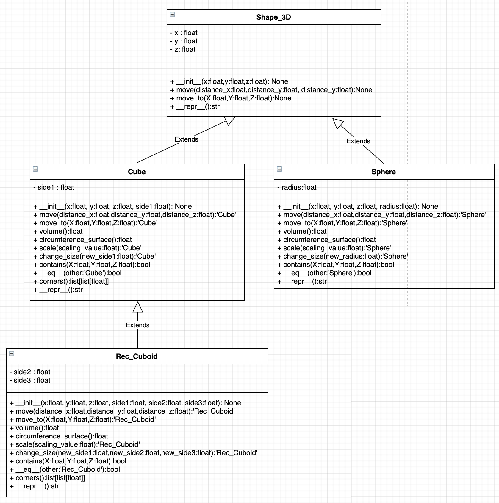

# Labb 3 : Shape plotter

## Instructions

For running the program, run Labb_3.py 

testing.py contains the tests

shapes.py contains the classes 

## Program description

This program lets the user create both 2D and 3D shapes and shows the created shapes. 

The 2D shapes that the user can create :
- Circle
- Rectangle
- Square

The 3D shapes the user can create:
- Cube
- Rectangular Cuboid
- Sphere

It also gives the user the ability to do some editing and comparing for the created shapes. 

For 2D shapes, the user can : 
- Check :
	- Area
	- Circumference
	- Informations about the shape
	- If the shape contains a particular point by giving its coordinates
- Move the shape with X and Y distances
- Move the shape to an exact point
- Scale the shape up or down
- Change the shape's dimensions
- For rectangle and cubes : rotate or make the shape horizontal or vertical.
- Compare a shape to other shapes from the same class 

For 3D shapes, the user can : 
- Check :
	- Volume
	- Circumference surface
	- Informations about the shape
	- If the shape contains a particular point
- Move the shape with X, Y and Z distances
- Move the shape to an exact point by giving its coordinates
- Scale the shape up or down
- Change the shape's dimensions
- Compare a shape to other shapes from the same class 

## UML Diagram of the 2D Shapes

## UML Diagram of the 3D Shapes

